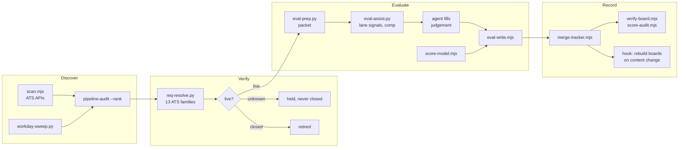

# career-ops-techart

A fork of [career-ops](https://github.com/santifer/career-ops) by
[Santiago Fernández de Valderrama](https://santifer.io), rebuilt around one question:
**when the pipeline says a job is live, reachable and a good fit, can you believe it?**

Career-ops turns an AI coding CLI into a job-search command center: it scans company
boards, evaluates postings against your CV, writes reports, tailors PDFs and tracks
applications. This fork was built while running a real senior technical-art and
AI-tooling search on it. Almost every failure that search surfaced had the same shape:
the tool returned an answer that looked exactly like a correct one and was wrong. A live
posting marked closed. A reachable role discarded by the location gate. A board reported
as holding 40 jobs because a loop stopped early. Nothing crashed, so nothing got
investigated.

This repository is the hardened result: a deterministic scoring model, a requisition
resolver that knows the difference between "closed" and "could not check", and a test
suite that runs green on a fresh clone and is mutation-verified.

---

## By the numbers

Measured on 2026-09-22. The first four rows compare this tree with `santifer/career-ops`
`main` on that date; the test rows are reproducible from a clone (CI runs them); the
commit and review counts come from the private development history this public tree was
cut from, and are stated rather than reproducible here.

| | |
|---|---|
| Files in this fork that do not exist upstream | **59** |
| Fork-original code | **45 files, 18,150 non-blank lines** (Node and Python) |
| Capabilities with no counterpart in upstream's source | **6** (see the comparison below) |
| ATS families the requisition resolver recognises | **13**: Amazon, Apple, Ashby, Breezy, Eightfold (including Netflix), GitHub Careers, Greenhouse, iCIMS, Lever, SmartRecruiters, SuccessFactors, Workable, Workday. Twelve are read; amazon.jobs blocks automated clients, so it answers an explicit `unknown` rather than a guess |
| Integration checks (`node test-all.mjs`) | **669 passed, 0 failed** on a fresh clone |
| Tool self-test suites | **23**, all green, all run by CI, running against fixtures rather than your data |
| Development since the fork point (2026-04-05) | **419 commits** (private history) |
| Independent-model review of the largest change | **17 rounds, 28 findings**, each fixed with a mutation-verified test (private history) |

### What the hardening found

Each of these was measured in the author's own search, fixed, and pinned with a test that
goes red if the fix is reverted. The counts depend on private data, so they cannot be
recomputed from this tree; the failure mechanisms can, because each has a test here.
[`docs/LESSONS.md`](docs/LESSONS.md) has the full catalog.

| Failure | Before | After |
|---|---|---|
| Title filter rejecting roles already evaluated as good fits | **224 of 392** evaluated roles rejected; the top-scoring role of the whole search among them | proven false negatives cut from **6 to 3**; the remaining 3 are reached by body-scoring board sweeps |
| Page cap read as a board size | one employer reported at exactly **800** postings (40 pages x 20) | real board of **2,000** read in full; a truncated walk now reports `TRUNCATED` and closes nothing |
| `total` re-read on every page | one tenant answers `436`, then `0`; **18 live in-lane roles** lost | `total` latched from the first page in every walker |
| Inbox rows no tool could settle | **220** unknown | **0**, and the pending inbox from **637 to 432**, with nothing closed on evidence the tool could not stand behind |
| A second, divergent writer of tracker scores | dry run would have changed **234 rows** while both integrity gates reported clean | one model and one recomputing writer; `score-audit.mjs` fails on any tracker/report disagreement, and `verify-board.mjs` fails any actionable row whose report has no machine-readable score |
| `(size, mtime)` change detection on NTFS | **137 of 200** same-size rewrites invisible to the board rebuild | content hashing |
| Guessed ATS board allowed to close postings | every live posting on one company-hosted site resolved **closed** | an inferred board may close a row only when its own listing links back to the host; impostor **0 of 2**, genuine boards **155/155, 168/168, 217/217, 273/273** |

---

## Compared with upstream

Upstream is broader, and it is the right starting point for most people: it ships an
installer, an i18n layer, roughly a hundred portal providers and a large contributor
community. This fork trades that breadth for depth on correctness, for one kind of
search. Each row below was checked against upstream `main`'s source on 2026-09-22, not
assumed, and the six marked **new** have no counterpart there.

| Capability | Upstream | This fork |
|---|---|---|
| **Scoring model** (new) | the evaluating model states a global score | `score-model.mjs`: one deterministic formula, `final = min(5, base × comp × pref × arrangement)`, 66 behavioural tests; `apply-model.mjs` is the only pass that recomputes tracker scores (dry run by default), and `score-audit.mjs --fix` can only restore a report's own stated final |
| **Requisition resolver** (new) | none | `scripts/req-resolve.py`: a posting URL to live / closed / unknown across 13 ATS families, with location, pay and JD read from the ATS's API or the posting's embedded data |
| **Provenance rule** (new) | none | a closure needs evidence the posting itself declared (such as a `gh_jid` in the URL); when both the board and the id were inferred, the board's own listing must also link back to the host the URL came from, or the row stays open |
| **Tracking-URL refusal** (new) | none | wrapper URLs are refused, including scheme-less, query-borne and percent-encoded destinations, because a tracker's 404 says nothing about the posting |
| **Board-level inbox liveness** (new) | per URL | each BOARD is read once (paged where the ATS pages), then the resolver settles the residue; an empty, unreadable or truncated board closes nothing |
| **Evaluation packets** (new) | none | `eval-prep` → `eval-assist` → `eval-blockers`: mechanical fields filled, judgement left null for the agent, blockers named |
| Page liveness | tri-state (active / expired / uncertain) | inherited from upstream and kept; the resolver applies the same rule to API reads |
| Location gate | keyword tiers matched against the location string; secondary locations folded in | each location option classified on its own and combined, with the state-scoped remote spellings real boards use (`US, PA, Remote`, `Indiana - Remote`, `Remote Massachusetts`, ...) resolved to a state and checked against your configured home state |

---

## How it fits together



- **Discovery** prefers an ATS API over web search. Measured on the source search: 58% of
  API-polled companies ever produced a lead against 10% of search-only ones.
  `scripts/find-ats.py` recovers a company's real board so it can be polled.
- **Verification** is where most of the fork's work went. See the engineering rules in
  [`CLAUDE.md`](CLAUDE.md) and the incidents behind them in [`docs/LESSONS.md`](docs/LESSONS.md).
- **Evaluation** splits the work: tools fill everything mechanical (location, comp band,
  liveness, lane vocabulary) and the agent supplies only judgement. The score then comes
  from one model, never from arithmetic in a prompt.
- **Recording** has one writer per fact and gates that exit non-zero on disagreement.

---

## Quick start

```bash
git clone https://github.com/sushiHex/career-ops-techart.git
cd career-ops-techart
npm install
npx playwright install chromium
node test-all.mjs --quick        # passes before you add any data; one warning (no CV yet) is expected
node setup.mjs                   # first-install configuration
```

`setup.mjs` asks who you are, what you are looking for and where you can work, and
writes every configuration file from **presets**. Or open Claude Code (or another CLI
that reads `AGENTS.md`) in the folder and it will run setup with you, from an answers
file, then help you build `cv.md`. Paste a job URL to evaluate it.
[`docs/SETUP.md`](docs/SETUP.md) has the details.

### Configuration

Everything personal lives in the User Layer, gitignored, and setup writes all of it:

| File | What it controls | Written from |
|---|---|---|
| `config/profile.yml` | name, targets, comp floor, past employers, preferred companies | your answers |
| `config/location.json` | home state, commute area, metros that are out, relocation stance | a location preset |
| `config/lane-vocab.json` | every scorer's lane terms, penalties, board lanes and title filter | a lane preset, plus your keywords |
| `modes/_profile.md` | archetypes, framing, negotiation posture | the template, plus the lane preset's profile |
| `portals.yml` | companies to poll and the title filter | the example template |

Nothing about a candidate is in code. Two presets ship: **`techart-ai-tooling`**, the
lane tuning this fork was built and regression-tested with, and **`general`**, which has
no opinion until you give it keywords. For location, **`california-socal`** is the policy
the gates were built on, kept as the worked example for adding your own state
([`presets/README.md`](presets/README.md)), and `remote-us` is the neutral default. With
no configuration at all the tools run on the neutral presets, and with no comp floor the
scoring model applies no comp gate rather than assuming one. The self-tests pin
themselves to the presets, so the California and tech-art regression cases keep
running whatever you configure.

---

## Verification

On a fresh clone (these are what CI runs):

```bash
node test-all.mjs           # 669 integration checks
npm run model:test          # 66 scoring-model tests
python scripts/req-resolve.py --selftest   # 20 routing + 353 behaviour cases
```

plus the `--selftest` of each tool listed in `.github/workflows/test.yml`. The tool
self-tests run against fixtures and pass with the network unavailable. `test-all.mjs`
also smoke-runs a few pipeline commands, which read your tracker and portal list when
they exist; on a fresh clone they take their no-data path.

Once you have a tracker, two gates check your own data:

```bash
npm run verify:board        # every actionable row has a machine-readable score
node score-audit.mjs        # tracker score, report header and report final agree
```

Before onboarding, `score-audit.mjs` says **NOT CHECKED** and exits 2, because no
tracker is not the same answer as a tracker that agrees.

New guards are **mutation-verified** as they land: the code is deliberately broken and
the matching test must go red. Several first drafts of tests stayed green under mutation
and were rewritten until they could fail.

---

## Known limitations

- **The location vocabulary is US-only.** Any US home state works from configuration,
  but the shared vocabulary (`presets/locations/_base-us.json`) knows US states, and a
  home outside the US needs its own.
- **Fewer portal providers than upstream.** This fork kept the ones its search used.
- **Apple's board cannot be polled** without a browser, and amazon.jobs returns an
  explicit bot-blocked verdict rather than a guess.
- **`scripts/check-remote.py` does not read LinkedIn `#LI-Hybrid` / `#LI-Remote` tags.**
  They are applied loosely, so it is a low-weight gap, but it is a known one.
- The pipeline never submits an application. It drafts, fills and generates, then stops.

---

## How it was built

Built with Claude Code as the implementation agent and OpenAI Codex as an independent
reviewer. The design, the verification rules and the
acceptance of each fix were mine. The largest change went through 17 review rounds, and
the recurring finding (a rule applied in one branch and not its sibling) is now written
down as a rule of its own.

## Credits and license

Built on [career-ops](https://github.com/santifer/career-ops) by
[Santiago Fernández de Valderrama](https://santifer.io), whose architecture (modes, the
user/system data contract, the tracker, the batch runner, the PDF pipeline and the Go
dashboard) this fork still stands on. "career-ops" is a trademark of Santiago Fernández
de Valderrama; this is an independent fork and is not affiliated with or endorsed by the original project. See
[`TRADEMARK.md`](TRADEMARK.md).

MIT licensed. See [`LICENSE`](LICENSE) and [`LEGAL_DISCLAIMER.md`](LEGAL_DISCLAIMER.md).
